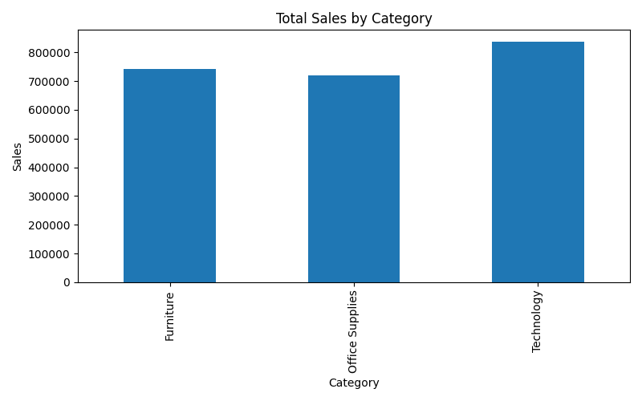
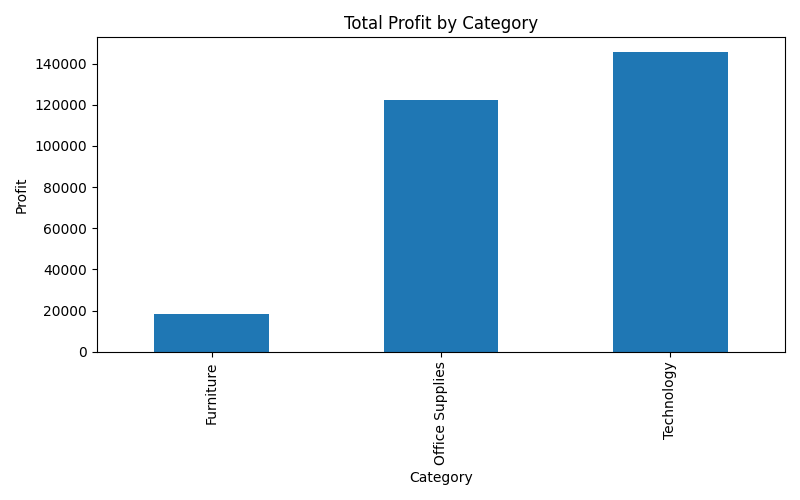
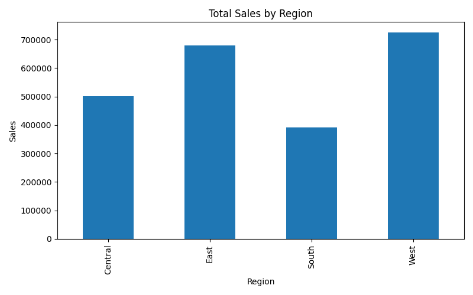
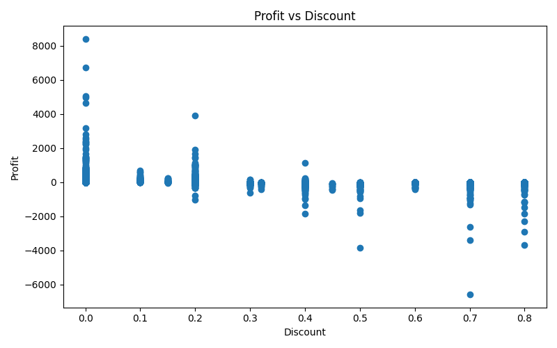

# Retail Sales Analysis Project

## Overview

This project performs Exploratory Data Analysis (EDA) on a retail sales dataset using Python. The objective is to identify sales trends, profit patterns, regional performance, and the impact of discounts on profitability.

## Tools and Libraries

- Python
- Pandas
- Matplotlib

## Dataset

The dataset contains retail transaction information including:

- Sales
- Profit
- Category
- Region
- Discount
- Quantity

## Analysis Performed

### 1. Sales by Category

Analyzed total sales generated by each product category.

### 2. Profit by Category

Compared profits across different product categories.

### 3. Sales by Region

Studied sales distribution across regions.

### 4. Profit vs Discount

Examined the relationship between discount levels and profit.

## Key Findings

- Technology generated the highest sales.
- Profitability varied significantly across categories.
- Regional sales performance showed noticeable differences.
- Higher discounts often resulted in lower profits.

## Conclusion

This project demonstrates practical data analysis techniques using real-world retail data. Visualizations help uncover patterns that can support business decision-making.
